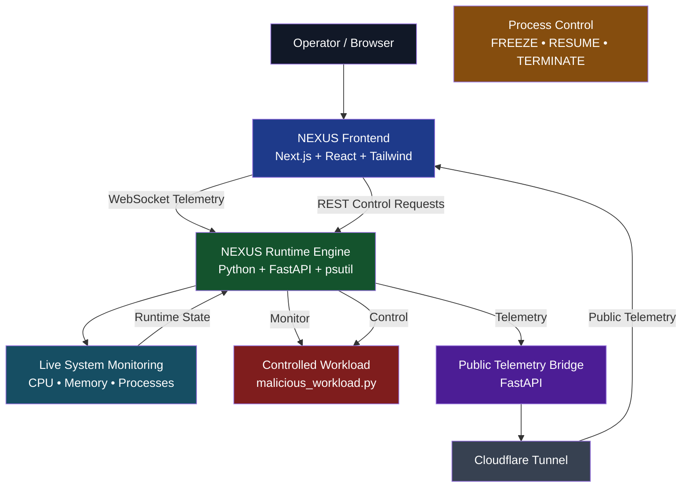
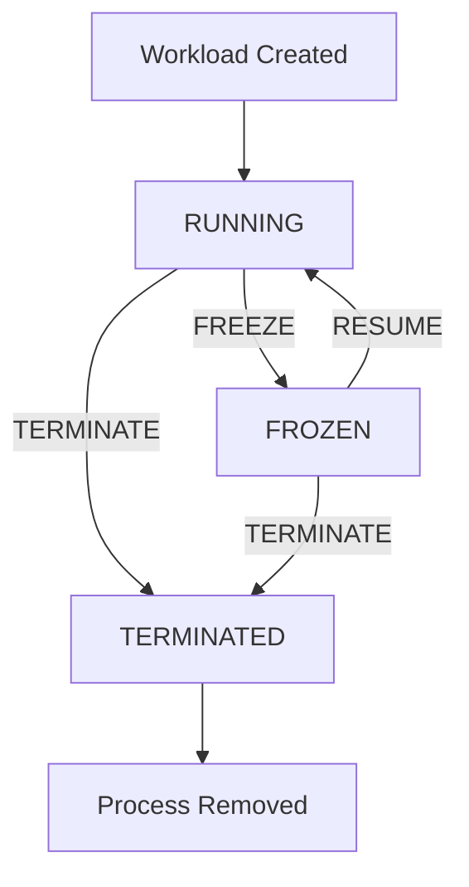
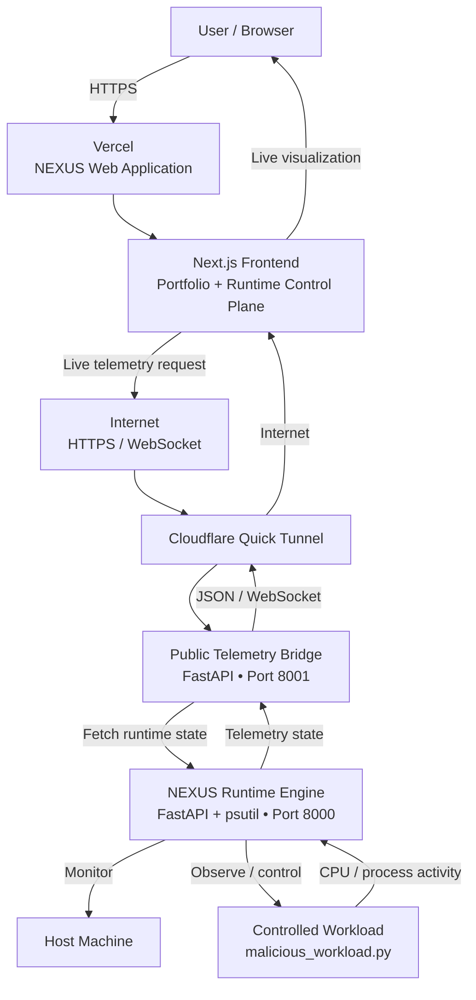

# NEXUS OS

## Runtime Control Plane for Live Process Monitoring and Control

NEXUS OS is a **user-space runtime monitoring and control prototype** designed to provide a unified interface for observing system activity and controlling a running workload in real time.

The project combines a **Next.js frontend**, **Python/FastAPI runtime engine**, **psutil-based process monitoring**, **WebSocket telemetry**, and **REST-based process control** to create an interactive Runtime Control Plane.

> **Important:** NEXUS OS is not a new operating-system kernel. It is a user-space prototype for runtime observability and process control.

---

## 🌐 Project Links

**Live Website:**  
https://nexus-os-beta-ten.vercel.app

**GitHub Repository:**  
https://github.com/SammyRyuga/NEXUS-OS

**GitHub Profile:**  
https://github.com/sammyryuga

**LinkedIn:**  
https://www.linkedin.com/in/samanyu-pattanayak-8757551a9/

**Developer:**  
Samanyu Pattanayak

---

# 📌 Overview

Modern operating systems expose large amounts of information about CPU usage, memory consumption, processes, and workload activity. However, these metrics are often distributed across different tools and interfaces.

NEXUS OS explores the concept of a **Runtime Control Plane** that brings observation and intervention into a single interactive interface.

The system allows an operator to:

- Observe live runtime activity
- Monitor CPU and memory usage
- Track active processes
- Visualize workload state
- View activity/threat indicators
- Freeze a running workload
- Resume a frozen workload
- Terminate a workload
- Observe the resulting changes through live telemetry

---

# 🎯 Objectives

The main objectives of NEXUS OS are:

1. Build a unified runtime monitoring interface.
2. Capture system and process information in real time.
3. Stream runtime telemetry to a web dashboard.
4. Provide process-level control operations.
5. Visualize workload lifecycle transitions.
6. Demonstrate a separation between public telemetry and local process control.
7. Provide a modern web interface for runtime observability.

---

# 🧠 Core Concept

The system is organized around a simple workflow:

```text
                    ┌───────────────────────┐
                    │    NEXUS Frontend     │
                    │ Next.js / React       │
                    └───────────┬───────────┘
                                │
                 ┌──────────────┴──────────────┐
                 │                             │
          Live Telemetry                  Process Control
                 │                             │
          WebSocket / API                  Local REST API
                 │                             │
                 └──────────────┬──────────────┘
                                │
                     ┌──────────▼──────────┐
                     │   NEXUS Engine      │
                     │ Python + FastAPI    │
                     │       psutil        │
                     └──────────┬──────────┘
                                │
                     ┌──────────▼──────────┐
                     │ Controlled Workload │
                     │ malicious_workload  │
                     │       .py           │
                     └─────────────────────┘
```

---

# 🏗️ System Architecture

The NEXUS OS prototype consists of the following major components.

## 1. NEXUS Frontend

The frontend provides the visual interface for the project.

Technologies:

- Next.js
- React
- Tailwind CSS
- Lucide Icons
- Motion / animation components

The frontend contains:

- NEXUS landing page
- Runtime Control Plane
- Live telemetry visualization
- Process control panel
- Architecture visualization
- Project presentation sections

---

## 2. NEXUS Runtime Engine

The runtime engine is implemented using:

- Python
- FastAPI
- psutil
- WebSockets
- REST APIs

The engine monitors the host system and maintains runtime information used by the frontend.

The runtime engine is responsible for:

- CPU monitoring
- Memory monitoring
- Process monitoring
- Runtime state tracking
- Workload identification
- Process-control operations
- Telemetry generation

---

## 3. Controlled Demonstration Workload

The project includes:

```text
backend/malicious_workload.py
```

This is a controlled demonstration workload used to generate observable CPU and process activity.

It is used to demonstrate the NEXUS runtime lifecycle.

The workload is **not intended to represent real malware**.

---

## 4. Public Telemetry Bridge

The project includes a separate telemetry bridge:

```text
backend/public_bridge.py
```

Its purpose is to expose runtime telemetry for demonstration purposes.

The public data flow is:

```text
NEXUS Engine
      ↓
Public Telemetry Bridge
      ↓
Cloudflare Tunnel
      ↓
Internet
      ↓
NEXUS Frontend
```

The telemetry bridge exposes runtime information but does not expose the local process-control endpoints.

---

# 🔄 Process Lifecycle

The controlled workload follows this lifecycle:

```text
             ┌──────────────┐
             │    START     │
             └──────┬───────┘
                    ↓
             ┌──────────────┐
             │   RUNNING    │
             └──────┬───────┘
                    │
             ┌──────┴───────┐
             │              │
          FREEZE          TERMINATE
             │              │
             ↓              ↓
      ┌──────────────┐  ┌──────────────┐
      │    FROZEN    │  │  TERMINATED  │
      └──────┬───────┘  └──────────────┘
             │
           RESUME
             │
             ↓
      ┌──────────────┐
      │   RUNNING    │
      └──────────────┘
```

---

# ⚙️ Core Features

## Live Runtime Monitoring

NEXUS visualizes runtime information including:

- CPU utilization
- Memory utilization
- Process count
- Process activity
- Runtime state
- Activity/threat indicators
- Estimated/model-derived power information

---

## Process Control

The dashboard provides three primary runtime controls:

```text
FREEZE
RESUME
TERMINATE
```

### FREEZE

Suspends the controlled workload so that its active execution is halted.

### RESUME

Restores the workload's execution.

### TERMINATE

Stops and removes the workload from the monitored process tree.

---

# 📡 Real-Time Telemetry

NEXUS uses WebSocket communication to provide continuously updated runtime information.

The basic flow is:

```text
Host System
    ↓
NEXUS Engine
    ↓
Runtime State
    ↓
WebSocket
    ↓
Frontend
    ↓
Live Dashboard
```

This allows runtime changes to be reflected on the dashboard without manually refreshing the page.

---

# 🛠️ Technology Stack

| Layer | Technology |
|---|---|
| Frontend | Next.js |
| UI | React + Tailwind CSS |
| Icons | Lucide |
| Backend | Python |
| API | FastAPI |
| Monitoring | psutil |
| Communication | REST + WebSocket |
| Public Telemetry | Cloudflare Tunnel |
| Deployment | Vercel |

---

# 📁 Project Structure

```text
NEXUS-OS/
│
├── backend/
│   ├── nexus_engine.py
│   ├── malicious_workload.py
│   └── public_bridge.py
│
├── nexus-ui/
│   ├── app/
│   │   ├── page.js
│   │   ├── nexus/
│   │   │   └── page.js
│   │   └── portfolio/
│   │       ├── page.js
│   │       └── components/
│   │           ├── NexusIntro.jsx
│   │           ├── NexusOverview.jsx
│   │           ├── NexusControlPreview.jsx
│   │           ├── NexusArchitecture.jsx
│   │           ├── NexusScrollStory.jsx
│   │           ├── NexusTransition.jsx
│   │           ├── ScrollProgress.jsx
│   │           ├── SectionDivider.jsx
│   │           └── About.jsx
│   │
│   ├── package.json
│   └── ...
│
├── .venv/
├── .gitignore
└── README.md
```

---

# 🚀 Local Installation

## Prerequisites

Make sure the following are installed:

- Python 3.x
- Node.js
- npm
- Git

---

## 1. Clone the Repository

```bash
git clone https://github.com/SammyRyuga/NEXUS-OS.git
cd NEXUS-OS
```

---

## 2. Create / Activate Python Environment

### Windows PowerShell

```powershell
python -m venv .venv
Set-ExecutionPolicy -Scope Process -ExecutionPolicy RemoteSigned
& .\.venv\Scripts\Activate.ps1
```

---

## 3. Install Backend Dependencies

```powershell
cd backend
pip install fastapi uvicorn psutil httpx
```

---

## 4. Start the NEXUS Engine

```powershell
python nexus_engine.py
```

The runtime engine runs locally on:

```text
http://127.0.0.1:8000
```

---

## 5. Start the Public Telemetry Bridge

Open another terminal and activate the environment.

```powershell
cd backend
& ..\.venv\Scripts\Activate.ps1
python public_bridge.py
```

The telemetry bridge runs on:

```text
http://127.0.0.1:8001
```

---

# 💻 Frontend Setup

Open another terminal:

```powershell
cd nexus-ui
npm install
npm run dev
```

The frontend will normally be available at:

```text
http://localhost:3000
```

---

# 🖥️ Available Pages

## Portfolio

```text
http://localhost:3000
```

## Runtime Control Plane

```text
http://localhost:3000/nexus
```

## Portfolio Route

```text
http://localhost:3000/portfolio
```

---

# 🧪 Running the Demonstration Workload

Open another terminal:

```powershell
cd backend
& ..\.venv\Scripts\Activate.ps1
python malicious_workload.py
```

The dashboard should begin displaying the workload's runtime activity.

The recommended demonstration sequence is:

```text
START WORKLOAD
      ↓
RUNNING
      ↓
FREEZE
      ↓
FROZEN
      ↓
RESUME
      ↓
RUNNING
      ↓
TERMINATE
      ↓
TERMINATED
```

---

# 🌍 Public Telemetry Demonstration

For temporary demonstrations, the telemetry bridge can be exposed through Cloudflare Tunnel.

Example:

```powershell
cloudflared tunnel --url http://localhost:8001
```

Cloudflare will generate a temporary public URL.

The architecture becomes:

```text
                    INTERNET
                        │
                        ▼
              ┌─────────────────┐
              │ Vercel Frontend │
              └────────┬────────┘
                       │
                       ▼
             ┌────────────────────┐
             │ Cloudflare Tunnel  │
             └─────────┬──────────┘
                       │
                       ▼
             ┌────────────────────┐
             │ Telemetry Bridge   │
             │    Port 8001       │
             └─────────┬──────────┘
                       │
                       ▼
             ┌────────────────────┐
             │   NEXUS Engine     │
             │    Port 8000       │
             └─────────┬──────────┘
                       │
                       ▼
             ┌────────────────────┐
             │ Controlled Workload│
             └────────────────────┘
```

### Important

Cloudflare Quick Tunnels are temporary demonstration infrastructure.

The public website receives telemetry originating from the machine running the telemetry bridge.

The website does **not** inspect the computers of visitors.

The process-control interface is designed to operate on the local development machine.

---

# 🔐 Security Model

NEXUS separates telemetry access from process control.

### Telemetry

```text
Frontend
   ↓
Telemetry Bridge
   ↓
NEXUS Engine
```

### Process Control

```text
Local Dashboard
   ↓
Local REST API
   ↓
NEXUS Engine
   ↓
Target Process
```

The public telemetry bridge does not expose the local process-control routes.

For a production deployment, additional security measures would be required, including authentication, authorization, secure credentials, and persistent infrastructure.

---

# 📊 Demonstration Results

The prototype is designed to demonstrate the following observable behaviors:

| Test | Action | Expected Observation |
|---|---|---|
| Test 1 | Start workload | Workload appears in runtime telemetry |
| Test 2 | FREEZE | Workload execution is suspended |
| Test 3 | RESUME | Workload execution resumes |
| Test 4 | TERMINATE | Workload exits and is removed |
| Test 5 | Live telemetry | Dashboard reflects runtime changes |

No fabricated benchmark values are included.

---

# 📸 Screenshots

## NEXUS Landing Page

**[INSERT SCREENSHOT HERE]**

Figure: NEXUS OS project landing page.

---

## Runtime Control Plane

**[INSERT SCREENSHOT HERE]**

Figure: NEXUS Runtime Control Plane dashboard.

---

## Live Telemetry

**[INSERT SCREENSHOT HERE]**

Figure: Live runtime telemetry visualization.

---

## Workload Running

**[INSERT SCREENSHOT HERE]**

Figure: Controlled workload in the running state.

---

## FREEZE Operation

**[INSERT SCREENSHOT HERE]**

Figure: Runtime state after applying FREEZE.

---

## RESUME Operation

**[INSERT SCREENSHOT HERE]**

Figure: Runtime state after applying RESUME.

---

## TERMINATE Operation

**[INSERT SCREENSHOT HERE]**

Figure: Runtime state after applying TERMINATE.

---

# 📐 Architecture Diagrams

## System Architecture



---

## Process Lifecycle



---

## Deployment and Data Flow



---

# ⚠️ Current Limitations

NEXUS OS is an academic and experimental prototype.

Current limitations include:

- It operates in user space.
- It does not implement a new operating-system kernel.
- The threat/activity indicator is prototype/model-derived logic rather than a production malware detector.
- Power information is estimated/model-derived unless connected to dedicated hardware measurement.
- Public telemetry depends on a running bridge and tunnel.
- The current public architecture is intended for demonstration rather than production infrastructure.
- Public process-control access is intentionally not exposed.

---

# 🔮 Future Scope

Possible future extensions include:

- Kernel-level integration
- eBPF-based observability
- Stronger process isolation
- Authenticated remote process control
- Persistent telemetry infrastructure
- Historical telemetry storage
- Advanced anomaly detection
- Real hardware power measurement
- Container monitoring
- Virtual machine monitoring
- Role-based access control
- Runtime alerts
- Historical workload analysis
- Distributed workload monitoring

---

# 📚 Project Documentation

The accompanying academic documentation follows the following structure:

1. Case Study
2. Introduction
3. Proposed Methodology
4. Implementation
5. Results
6. Discussions

The report includes:

- Project objectives
- System architecture
- Implementation details
- Runtime lifecycle
- Telemetry flow
- Deployment architecture
- Results
- Limitations
- Future scope

---

# 👨‍💻 Author

## Samanyu Pattanayak

**Project:** NEXUS OS  
**Registration No.:** `[INSERT REGISTRATION NUMBER]`  
**Department:** `[INSERT DEPARTMENT]`  
**Institution:** `[INSERT COLLEGE / UNIVERSITY]`  
**Academic Year:** `[INSERT ACADEMIC YEAR]`

### Links

- Website: https://nexus-os-beta-ten.vercel.app
- GitHub: https://github.com/SammyRyuga/NEXUS-OS
- GitHub Profile: https://github.com/sammyryuga
- LinkedIn: https://www.linkedin.com/in/samanyu-pattanayak-8757551a9/

---

# 📜 License / Usage

No open-source license has been assigned to this repository.

The project is provided as an academic project and demonstration prototype.

---

# ⚖️ Disclaimer

NEXUS OS is an academic and experimental runtime monitoring and process-control prototype.

The included workload is a controlled demonstration workload intended to generate observable system activity.

It is not intended to be used for malicious activity, unauthorized access, or interference with systems belonging to others.
